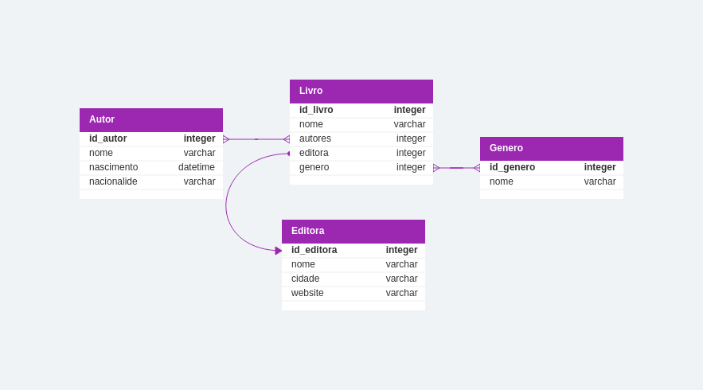

# Tutorial Django

## Diagrama



## Ambiente Virtual

```bash
py -m venv .venv
.venv/Scripts/activate
pip install -r requirements.txt
```

## Iniciando servidor

```bash
python3 manage.py runserver
```